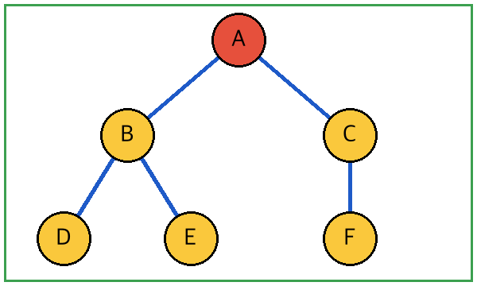

## 1. [8.5점]
기계 학습에서 학습 데이터와 테스트 데이터를 나누는 까닭으로 가장 적절한 것은?

① 계산 시간을 줄이기 위해
*② 새로운 데이터에 대한 성능을 가늠하기 위해
③ 데이터의 결측치를 채우기 위해
④ 모델의 매개변수 수를 늘리기 위해
⑤ 학습률을 자동으로 정하기 위해

## 2. [9.0점]
분류 모델의 성능 지표에 대한 설명으로 옳은 것만을 〈보기〉에서 있는 대로 고른 것은?

:::보기
ㄱ. 정확도는 전체 중 맞힌 비율이다.
ㄴ. 재현율은 실제 양성 중 양성으로 예측한 비율이다.
ㄷ. 정밀도는 예측 양성 중 실제 양성의 비율이다.
ㄹ. 세 지표는 같은 값을 가진다.
:::

① ㄱ, ㄴ
② ㄴ, ㄹ
③ ㄷ, ㄹ
*④ ㄱ, ㄴ, ㄷ
⑤ ㄱ, ㄴ, ㄷ, ㄹ

## 3. [10.5점]
다음은 어느 학급의 사진 분류 모델을 설명한 글이다. 이 모델의 문제점을 바르게 지적한 것은?

:::자료
이 모델은 훈련용 사진에서 오답률이 1%였지만 새로 찍은 3반 사진에서는 오답률이 45%로 크게 뛰어올랐다.
:::

*① 학습 데이터에 지나치게 맞춰져 일반화가 안 된 과적합 상태이다.
② 학습 데이터가 너무 적어 아직 규칙을 찾지 못한 과소적합 상태이다.
③ 테스트 데이터의 정답이 잘못 표시되어 있어 지표를 믿을 수 없는 상태이다.
④ 학습률이 너무 커서 손실 값이 발산하고 있는 상태이다.
⑤ 입력 특징의 단위가 달라 거리 계산이 한쪽으로 치우친 상태이다.

## 4. [9.5점]
표는 고객 4명의 특징과 실제 구매 여부이다. 이에 대한 설명으로 적절한 것은?

| 방문일 | 쿠폰 수 | 구매 여부 |
|---|---|---|
| 15 | 2 | 아니오 |
| 40 | 7 | 예 |

① 방문일은 라벨이다.
② 쿠폰 수는 라벨이다.
③ 구매 여부는 입력 특징이다.
④ 표에는 라벨이 없다.
*⑤ 구매 여부는 라벨이고 나머지는 입력 특징이다.

## 5. [10.0점]
그림은 어떤 탐색 과정을 나타낸 것이다. 이 탐색에 대한 설명으로 옳은 것은?

{width=6cm}

① 깊이 우선 탐색은 큐를 쓴다.
② 너비 우선 탐색은 스택을 쓴다.
*③ 너비 우선 탐색은 시작 지점에서 가까운 순서로 방문한다.
④ 깊이 우선 탐색은 최단 경로를 보장한다.
⑤ 두 탐색은 방문 순서가 같다.

## 6. [11.0점]
(가)~(다)에 해당하는 학습 방식을 바르게 짝지은 것은?

:::자료
(가) 정답 붙은 사진으로 고양이와 개를 가려 낸다.
(나) 바둑 프로그램이 이긴 판을 보상 삼아 수를 익힌다.
(다) 신문 기사들을 주제별로 가려낸다.
:::

:::답항표 머리="(가)|(나)|(다)"
① 강화 | 지도 | 비지도
*② 지도 | 강화 | 비지도
③ 비지도 | 강화 | 지도
④ 지도 | 비지도 | 강화
⑤ 강화 | 비지도 | 지도
:::

## 7~8. 세트
다음 글을 읽고 물음에 답하시오.

:::자료
어느 동아리가 사진 파일 두 개를 저장했다. 파일 가는 가로 40픽셀, 세로 30픽셀의 흑백 사진이고, 파일 나는 같은 크기의 컬러 사진이다. 흑백은 픽셀마다 1바이트, 컬러는 3바이트를 쓴다.
:::

### 7. [9.5점]
파일 가의 크기(바이트)는?

① 1000
② 1100
③ 1150
*④ 1200
⑤ 1300

### 8. [10.5점]
두 파일을 비교한 설명으로 옳은 것은?

*① 파일 나의 크기가 파일 가의 3배이다.
② 파일 가의 크기가 파일 나보다 크다.
③ 두 파일의 크기는 같다.
④ 파일 가는 픽셀 하나에 3바이트를 쓴다.
⑤ 파일 나는 픽셀 수가 파일 가보다 많다.

## 9. [10.5점] {답항=3행}
다음 중 지도 학습에 대한 설명으로 옳지 __않은__ 것은?

① 정답이 있는 데이터로 학습한다.
② 분류와 회귀가 여기에 속한다.
③ 학습 뒤 새 입력의 출력을 예측한다.
*④ 정답 없이 데이터의 구조를 찾는다.
⑤ 스팸 메일 판별에 쓸 수 있다.

## 10. [11.0점]
표는 두 모델의 지표이고, 〈보기〉는 이에 대한 해석이다. 옳은 것만을 〈보기〉에서 있는 대로 고른 것은?

:::자료
| 모델 | 정밀도 | 재현율 |
|---|---|---|
| A | 0.9 | 0.5 |
| B | 0.6 | 0.9 |
:::

:::보기
ㄱ. A는 놓치는 스팸 메일이 B보다 많다.
ㄴ. B는 정상 메일을 스팸으로 예측하는 경우가 A보다 많다.
ㄷ. 두 모델의 정확도는 같다.
:::

① ㄱ
② ㄷ
*③ ㄱ, ㄴ
④ ㄴ, ㄷ
⑤ ㄱ, ㄴ, ㄷ
